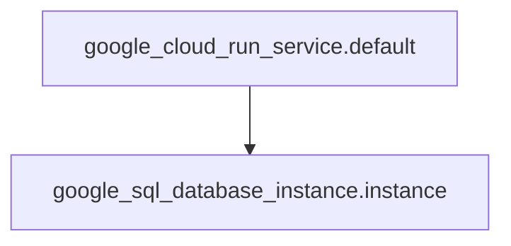

# Module
## Required Providers
```terraform
terraform {
  required_providers {
    google = {
      source = "hashicorp/google"
      version = "7.12.0"
    }
  }
}
```

## Requirements
The following providers are required:
* hashicorp/google (7.12.0)

## Variables
This module does not expose any variables.

## Resources
The following resources are deployed by this module:
* `google_cloud_run_service.default`: Configures a Google Cloud Run service named "cloudrun-srv" in the `us-central1` region, using the `us-docker.pkg.dev/cloudrun/container/hello` image. It also configures autoscaling and links to a Cloud SQL instance.
* `google_sql_database_instance.instance`: Creates a Google Cloud SQL database instance named "cloudrun-sql" in the `us-east1` region, with `MYSQL_5_7` database version and `db-f1-micro` tier settings. Deletion protection is enabled.

## Output
This module does not have any outputs.

## Mermaid Chart
Here's your flowchart diagram:



[View at MermaidChart](https://mermaidchart.com/play?utm_source=mermaid_mcp_server&utm_medium=remote_server&utm_campaign=gemini#pako:eNqrVkrOT0lVslJKL0osyFAIcYnJU1BIz89Pz0mNT87JL02JLyrNiy9OLSrLTE7VS0lNSyzNKVHQ1bWDKSouzIlPSSxJTEosTo3PzCsuScwDKoQxlGoBtDgkAw)

The diagram illustrates that the `google_cloud_run_service.default` resource depends on the `google_sql_database_instance.instance` resource. This dependency is inferred from the `cloudsql-instances` annotation in the Cloud Run service, which references the connection name of the SQL instance.