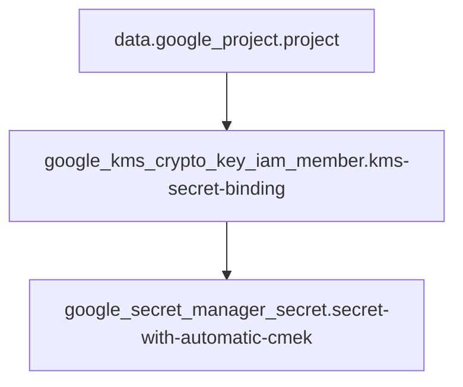

The Mermaid chart has been successfully generated. Now I have all the information to construct the `README.md` file.

# Module

## Required Providers

```terraform
terraform {
  required_providers {
    google = {
      source  = "hashicorp/google"
      version = "7.12.0"
    }
  }
}
```

## Requirements

| Provider | Version |
|----------|---------|
| google   | 7.12.0  |

## Variables

This module does not contain any input variables.

## Resources

*   `data "google_project" "project"`: Fetches information about the Google Cloud project.
*   `resource "google_kms_crypto_key_iam_member" "kms-secret-binding"`: Manages an IAM member for a KMS crypto key, granting the Secret Manager service account permission to encrypt/decrypt.
*   `resource "google_secret_manager_secret" "secret-with-automatic-cmek"`: Creates a Secret Manager secret with automatic customer-managed encryption keys (CMEK) using the specified KMS key.

## Output

This module does not contain any outputs.

## Mermaid Chart



[View at MermaidChart](https://mermaidchart.com/play?utm_source=mermaid_mcp_server&utm_medium=remote_server&utm_campaign=gemini#pako:eNo1jkEKwjAQRa8Ssk8O4EKw9QjuqoRpOqQxThLSESni3S12nM3wef_Bf2tfJtQHHRrUWV3O16y2Ow0TMNhQSnigq63c0bOVf9s73SA40eJ8WysXl3B1EcgR0ojNbsQs6BuyGWOeYg7i9n93p44gQ8Am0YrzijwbeHIh4OiNJ0ybLwuVMUfVyZRf6PXnCybaSBE)