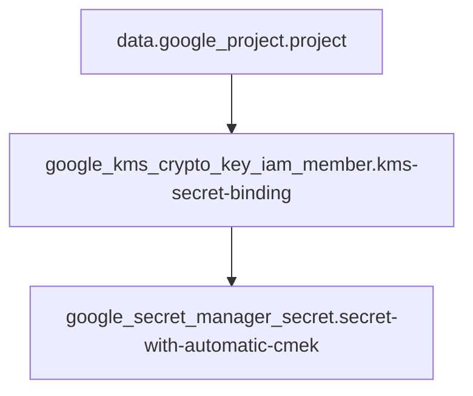

# Module

## Required Providers

```hcl
terraform {
  required_providers {
    google = {
      source  = "hashicorp/google"
      version = ">= 7.12.0"
    }
  }
}
```

## Variables
_No variables defined in the snippet._

## Resources

- `google_kms_crypto_key_iam_member.kms-secret-binding`
- `google_secret_manager_secret.secret-with-automatic-cmek`

## Mermaid Chart



[Edit in Mermaid Chart Playground](https://mermaidchart.com/play?utm_source=mermaid_mcp_server&utm_medium=remote_server&utm_campaign=claude#pako:eNqdjbEOwjAMRH8lyu58AAMTn8CIFLmplYbgOHKNUIX4dyo1AzO3nE7v7Hv7JDP5k8-KfXHXy625XTMahiySHxS7yp2SheEO4OwGqrzGpFs3iZW2WJAjE0-kYSewUlIymEqbS8vH4z8OfwcPEhkbZtIRw-i_ii2ATxNGKwkSU_WfL0ZKU-M)